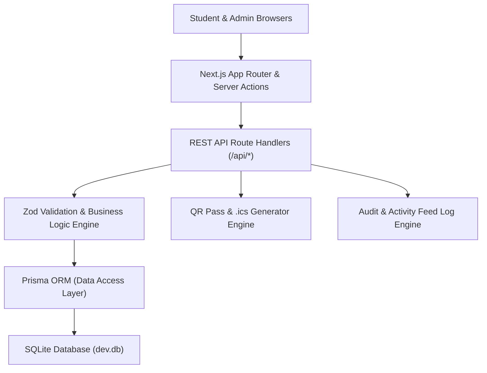

# CampusConnect — System Architecture & Design Documentation

## 1. System Overview

CampusConnect is designed as a modular, full-stack Next.js web platform for college society events and registrations.

---

## 2. Data Lifecycle Workflows

### 2.1 Event Registration Lifecycle
1. **Discovery & Exploration**: Student browses `/events`, selects category filters, or uses `Cmd+K` global search / Grounded AI Assistant.
2. **Capacity Validation**: System derives real-time seat availability (`registeredCount / capacity`).
3. **Duplicate Prevention**: Backend checks `[eventId, email]` composite uniqueness in database.
4. **Waitlist Placement**: If event capacity is reached, student registration is automatically flagged as `WAITLISTED` with `waitlistPosition`.
5. **Pass Generation**: Server returns unique `registrationCode` (e.g. `CC-2026-89412`). Client generates downloadable QR Registration Pass and `.ics` calendar invite.

### 2.2 Desk Check-In Lifecycle
1. Organizer scans QR code or enters Registration Code at `/admin/checkin`.
2. System queries database by `registrationCode`.
3. Verifies status (`CONFIRMED` -> `CHECKED_IN`).
4. Prevents duplicate check-ins by raising `ALREADY_CHECKED_IN` warning if `CheckIn` record already exists.
5. Records `checkedInAt` timestamp and updates attendance statistics.

---

## 3. Database Schema Overview

- **User**: System admins and society event leads (`SUPER_ADMIN`, `CLUB_ADMIN`, `ORGANIZER`).
- **Club**: Student societies and chapters.
- **Event**: Core event entities with capacity, date/time, venue details, status, and tags.
- **Registration**: Student registrations with unique registration codes, duplicate protection, and waitlist tracking.
- **CheckIn**: Attendance verification records linked to registrations.
- **Feedback**: Post-event rating (1-5 stars) and reviews.
- **AuditLog**: System activity log for admin security and audit trails.
